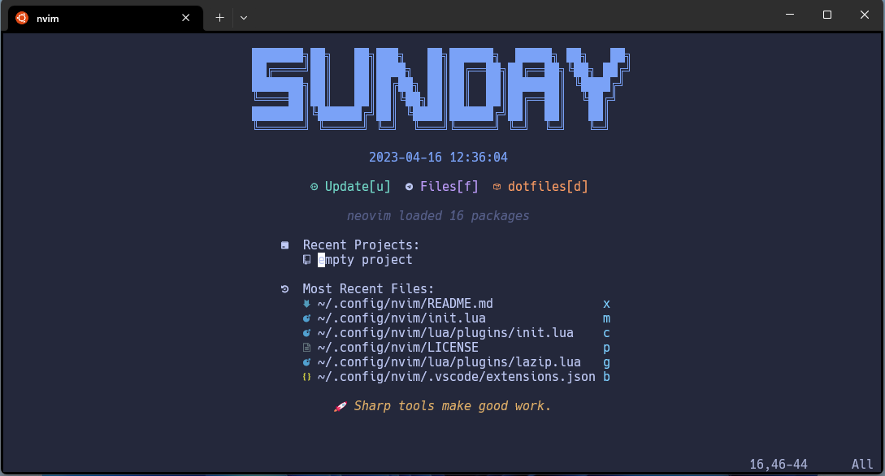

<div align="center">

# **NeoVim Configuration**

<p>
    <a href="https://github.com/jeffercbs/nvim/pulse">
      
    </a>
    <a href="https://github.com/jeffercbs/nvim/blob/main/LICENSE">
      
    </a>
    <a href="https://github.com/jeffercbs/nvim/stargazers">
      
    </a>
    <a href="https://github.com/jeffercbs/nvim/issues">
      
    </a>
    <a href="https://github.com/jeffercbs/nvim">
      
    </a>
  </p>
</div>
<div align="center">
  
</div>

---

## ⚡️ **Requirements**

- Neovim >= **0.8.0** (needs to be built with **LuaJIT**)
- Git >= **2.19.0** (for partial clones support)
- a [Nerd Font](https://www.nerdfonts.com/) **_(optional)_**

## 🚀 **Getting Started**

### windows

```shell
Invoke-WebRequest https://raw.githubusercontent.com/jeffercbs/nvim/main/scripts/win/install.ps1  -UseBasicParsing | Invoke-Expression
```

### linux

```shell
git clone https://github.com/jeffercbs/nvim.git ~/.config/nvim --depth 1 && nvim
```

## Uninstall

```shell
  # linux/macos (unix)
  rm -rf ~/.config/nvim
  rm -rf ~/.local/share/nvim
  rm -rf ~/.cache/nvim

  # windows
  Invoke-WebRequest https://raw.githubusercontent.com/jeffercbs/nvim/main/scripts/wins/uninstall.ps1 -UseBasicParsing | Invoke-Expression
```
